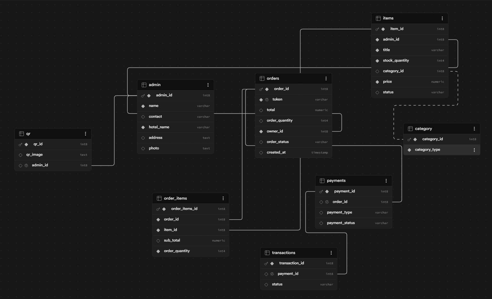

## Database Design (ER Diagram)

The QR-based shopping system is designed using a normalized relational schema consisting of:

- **Admin** manages vendor details and inventory.
- **QR** maps each vendor to a unique scannable code.
- **Items** stores product information, stock, and pricing.
- **Category** classifies products.
- **Orders** stores temporary guest orders and generated tokens.
- **Order_Items** resolves the many-to-many relationship between orders and items.
- **Payments** records payment method details.
- **Transactions** stores payment transaction status.

### Entity Relationship Diagram

